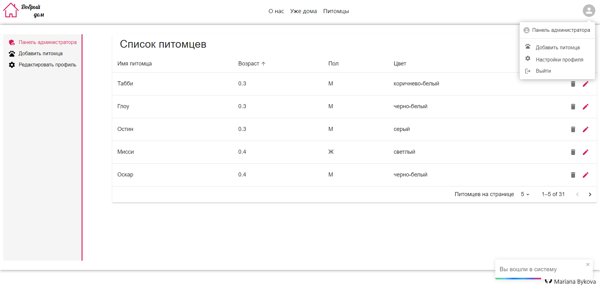

# Веб-приложение. Приют для кошек и собак.

## Стек технологий
- React, Typescript
- Redux Toolkit
- NodeJS, Express, Sequelize CLI, PostgreSQL
- Material-UI, SASS

Разработаны:
1. Авторизация администратора, JWT.
2. Личный кабинет администратора:
   * Редактирование личных данных
   * Добавление новых питомцев в приют
   * Панель администратора (таблица со списком питомцев с возможностью их редактирования, удаления/отправления в архив)
3. Страница с питомцами приюта ( сортировка, фильтрация, пагинация )
4. Страница для каждого питомца
5. Страница питомцев, нашедших дом (у администратора есть возможность добавления истории обретения дома питомцем)

#### Логин/пароль для входа администратора: admin@mail.ru, 123

### Скриншоты проекта

- Главная страница

- Окно авторизации администратора

- Страница со списком питомцев приюта

- Страница питомца

- Панель администратора со списком питомцев

- Профиль администратора с возможностью редактирования данных

- Форма для добавления нового питомца

- Форма редактирования питомца

- Страница с питомцами, нашедшими дом

- Редактирование историй питомцев администратором 

